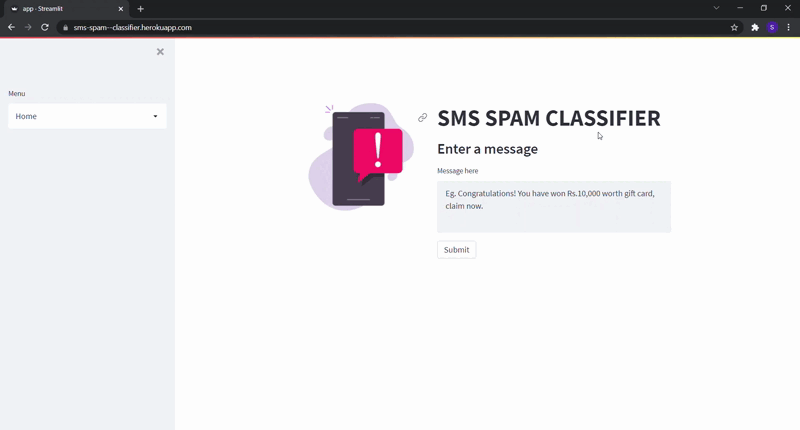

# Spam_classifier_NLP
Spam classification using Natural Language Processing.
## Approach and steps involved for model development

- Import the modules, dependencies and load the dataset.
- Analyse the dataset, get shape,info and check for null values and balance of the dataset.
- Do Exploratory Data Analysis and data visualization.
- Slice the data into features and label.
- Create a analyzer(function) for Text Normalization.
  - Tokenization - split text into list of words.
  - Stopwords exclusion - remove punctuations and Stopwords.
  - Stemming - transform each word in text into its base form (lemma).
- Split the data into training and testing datasets.
- Create Pipeline with vectorization and classifier as sequence of operations.
  - Perform vectorization using analyzer.
- Train the models and compare the models.

## Conclusion

Normalized text in a good way to minimize the Bag of words vector and improved the importance (tfidf score) of each word in corpus. Developed good models for SPAM Classification using Natural Language Processing with accuracy around 97.0

## Steps for running the Web App

- Cloning the Repository:

      git clone https://github.com/sudheer1098/Spam-Classifier-NLP.git

- Entering the project directory:

      cd Spam-Classifier-NLP

- Setting up the Python Environment with the dependencies:

      pip install -r requirements.txt

- Running the Web App:

      streamlit run app.py

- Stopping the Web App from the terminal:

      Ctrl+C

# Demonstration

